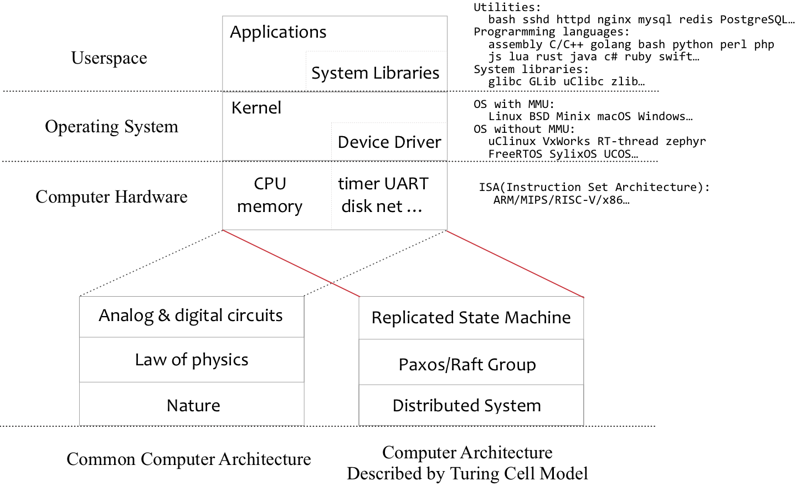
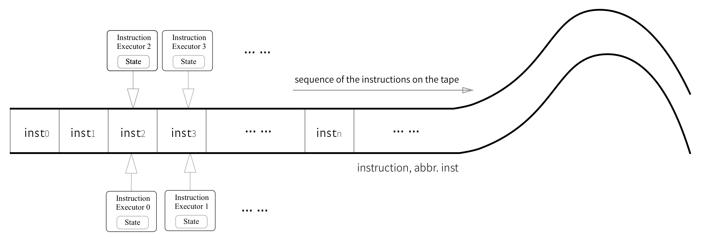

# TuringCell: Run Linux over Paxos/Raft


## What is Turing Cell?



**Turing Machine + Paxos/Raft = Turing Cell**

A Turing Cell computer is an implementation of Turing Cell model, which just like the common computer is the implementation of the Turing Machine model.

A Turing Cell computer has no big differences with a common computer except it runs over a Paxos/Raft group and thus it has all those natural supports for high availabilty, fault tolerance, high consensus and any property that a Paxos/Raft group could has (others like membership changement, multi-master in Paxos and etc).

So, you can run any operating system and its corresponding userspace applications over a Turing Cell computer just as you could do on a common computer as long as this operating system supports the ISA and I/O devices of this certain Turing Cell computer implementation. In addition to the running of Linux which the OS needs MMU, you could also even choose to run a RTOS without MMU requirement or even the bare metal way if you really care about the performance of your distributed applications.

What is Cell？

一般的生物细胞组织在受到一定程度的非致命性伤害后，能够进行损伤的自我恢复，同时细胞组织能保证其在整体系统中的功能处于一定程度的正常状态，而TuringCell computer也具有一定程度与之类似的特性

## Details and Proof of Turing Cell Model

### 复制状态机运行模型



什么是复制状态机？

“复制状态机”模型(Replicated State Machines, abbr. RSM)：

基于分布式一致性算法（比如通过将无穷多个Paxos运行实例顺序地组合在一起，相关更多的内容请阅读<Paxos Made Easy>），构建出一个强一致的、具有一定容错能力的、高可用的无限长分布式指令纸带，多个具有相同起始状态的状态机执行者从前到后依次地执行纸带上的指令，假如说每一条指令都是数学确定的，那么可以肯定的是，当所有状态机执行者在执行完纸带上相同位置的某一个相同指令时，所有状态机的内部状态都必然是相同的，这种运行模型被称为“复制状态机模型”。复制状态机的实质就是通过一个强一致的、具有一定容错能力的、高可用的无限长分布式指令纸带得到一个强一致的、具有一定容错能力的、高可用的分布式状态机。

定义 Mathematical Deterministic Function 数学确定函数 𝘮𝘥𝑓

在任何情况之下，只要给mdf函数一个确定的输入状态S1，那么就必然能够唯一地、确定地映射到一个确定的输出状态S2 即

&emsp;**S2 = mdf(S1)**

如此 我们可以得到“mdf”函数版的RSM定义

... ... 多个具有相同起始状态的状态机执行者从前到后依次地执行此分布式指令纸带上的指令 -- 即mdf函数，由于mdf函数的特性，那么可以肯定的是，当所有状态机执行者在执行完纸带上相同位置的某一个特定𝘮𝘥𝑓函数时，所有状态机的内部状态都必然是相同的，这种运行模型我们称之为”复制状态机“模型

即如下图所示


### 普通计算机运行模型


从某种意义上讲 计算机的运行可以看成是一个连续的状态迁移序列 即

```
state{cpu regsters' state, memory state, i/o devices' state}
```

为了简化模型 我们下面只讨论拥有单周期指令的计算机 当然这些结论也可以很容易地推广到更一般的计算机运行模型中去 

假设将运行中的计算机在t1时钟周期开始时的状态记为S1，t2时钟周期开始时的状态记为S2，已知t2>t1，那么必然会存在一种状态映射的函数f，使得

&emsp;**S2 = f(S1)**

那么我们可以把计算机的运行看成是一个又一个这样的f函数（即当前时钟周期要执行的CPU指令所等价的f函数）的依次执行


### Turing Cell = Replicated State Machine + Turing Machine

综上（mdf-RSM-diagram & f-common-computer-diagram） 我们可以得到

TuringCell定理： 对于一个普通计算机运行模型𝒞，其𝑓函数为𝑓n，其中n为非负整数，假如存在一个复制状态机运行模型ℛ，其𝘮𝘥𝑓函数为𝘮𝘥𝑓n，其中n为非负整数，若有对于任意的n，𝑓n与𝘮𝘥𝑓n均是等价的条件成立，那么我们可以称𝒞与ℛ是状态迁移等价的

对于一般的计算机而言 所有的CPU指令都可以看成是一种mdf函数 唯一向系统的状态中引入随机成分的是I/O设备--其根本原因在于I/O的本质是系统与自然界的交互 所以通过给RSM复制状态机的指令执行中引入I/O机制使得其能够与外界进行数据交互来实现对I/O设备的mdf函数化 那么 综上可得 对于一般的计算机模型而言 TuringCell定理中阐述的这种等价描述是存在并且可以被实现的

## Design of the TuringCell Computer


v0.1 CPU选型

```
x86 or x64
    工程量大 单纯的体力活 由于CISC-CPU的解码器更复杂 所以CISC-CPU的解释性能相比RISC-CPU会有一定的劣势
    工具链生态繁荣度: 优秀
    可维护性: 差
arm
    实现难度: RSIC 实现难度低 解码简单 指令相比CISC更简洁
    工具链生态繁荣度: 良 但是由于arm产品更新太快 老的架构会被gcc deprecated 可能需要不定期跟踪更新新架构
    可维护性: 优
mips
    实现难度: RSIC 实现难度低 解码简单 指令相比ARM更简洁
    工具链生态繁荣度: 不乐观 gcc上mips的提交频率相比arm低太多了 前景堪忧
    可维护性: 优
CISC指令译码多路并行mutiplexer实现对于FPGA/AISC等硬件电路来说是拿手好戏 但对串行的CPU核心来说为弱势 RISC的译码就简单很多了

--> 最终决定选择模拟armv4t架构 (S3C2440 -> ARM920T -> ARMv4T & mmu)
```

timer 至关重要 实现操作系统中的任务分时抢占
时钟周期 计数
指令周期 指令执行个数

## kv布局

```
kv
    turingcell_computer_0
        cpu_state
        ram_state
        io_devices
            timer_state
            uart_state
    turingcell_computer_1
    ...
    turingcell_computer_n
```

## 与外界的交互

sequence_number


## 详细设计

```
cpu ram io_device_registers
io_device{ 
    private_ram,
    private_durable_storage
}

pre_cpu_exec_phase
    io_device_pre_cpu_exec_phase_handler
        timer
        uart
cpu_exec_phase
    cpu_exec(exact_cpuclk_to_run)
        armv4_cpu
    io_device_registers_read/write_handler()
        timer
        uart
    io_device_cpuclk_timer_routine
        timer
post_cpu_exec_phase
    io_device_post_cpu_exec_phase_handler
        timer
        uart
```
